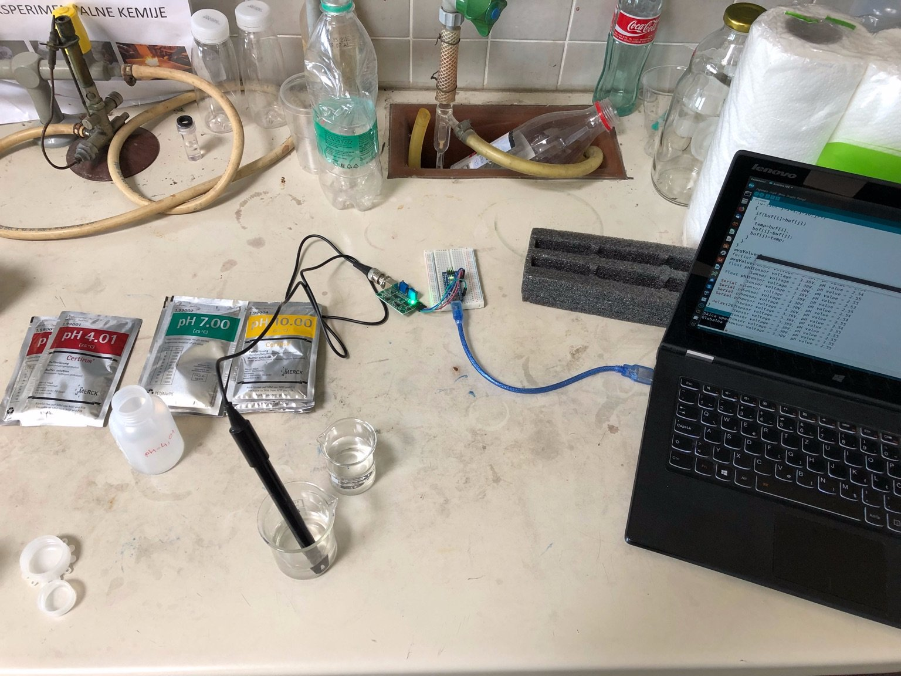
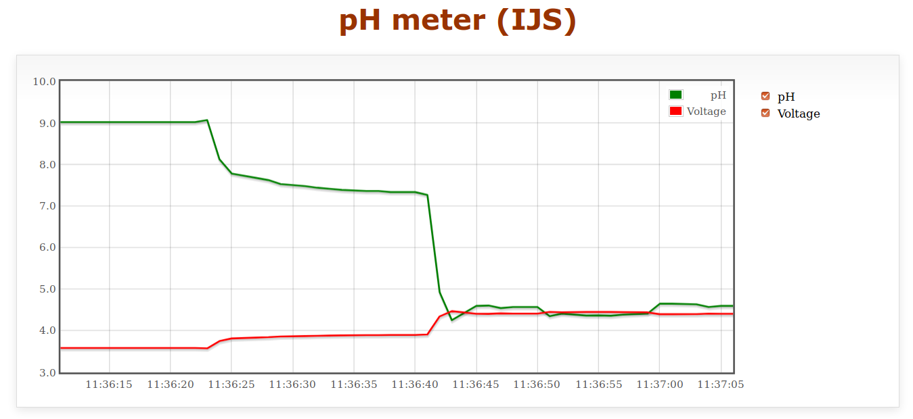
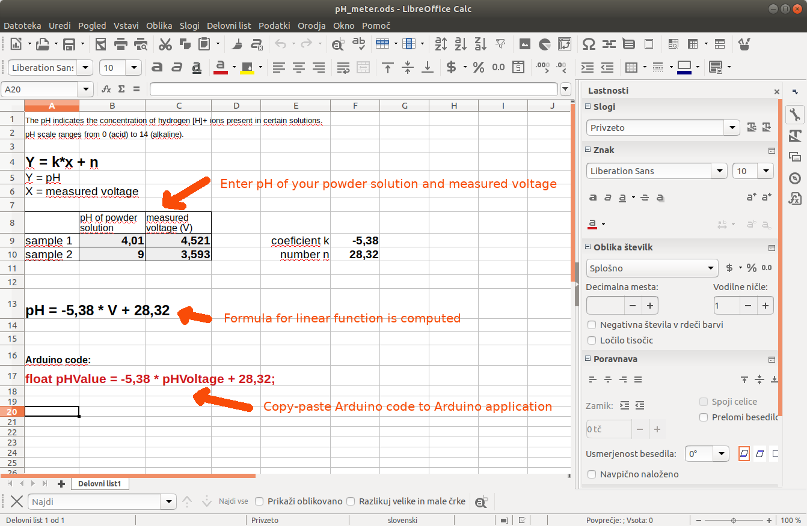
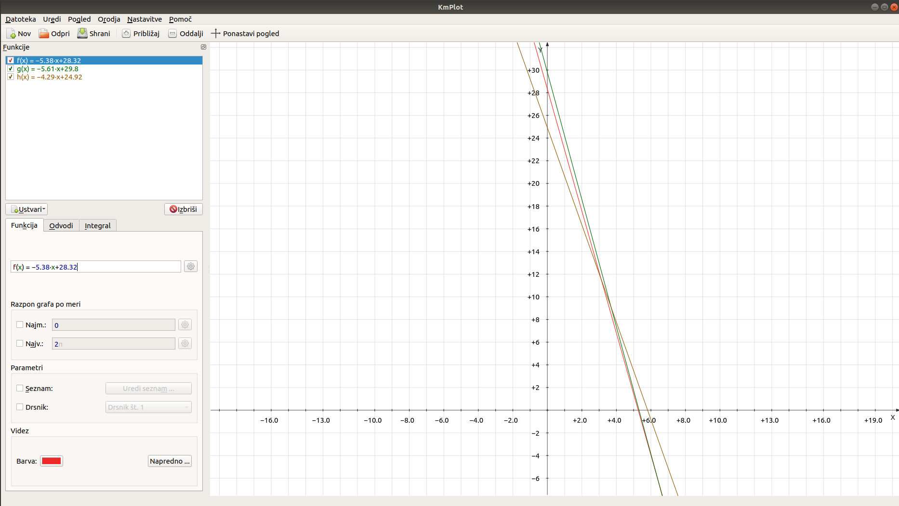

# pH Meter
Arduino based BlueSensor compatible pH meter.

pH is a measure of acidity or alkalinity of a solution. pH scale ranges from 0 (acid) to 14 (alkaline). The pH indicates the concentration of hydrogen [H]+ ions present in certain solutions.


 
## Materials needed
- Arduino Nano
- cheap pH meter probe with circuit

We used PH-4502C, which costs around 10 EUR, but it is unfortunately of a very low quality. However there are similar (compatible) probes on the market.

Compatible probes have the following pinout:
- To (temperature)
- Do (limit ("digital") pH signal)
- Po (analog pH value)
- G (nalog GND)
- G (supply GND)
- V+ (5V power supply)

(Circuit uses one ground for a circuit and one separated ground for a probe.)


## Wiring
pH meter - Arduino Nano
- V+ --- 5V
- G  --- GND
- G  --- GND
- Po --- A0
- Do --- (not connected)
- To --- (not connected)

## Calibration
Please note that you need to calibrate pH sensor. In order to do this, you need two pH reference values and measure the voltage returned by the sensor on the pin Po. The best thing to do is to use a calibration solution in powders. Use two powders with known pH and obtain the respective voltages. Then compute the formula (k and n): `pHValue = k * phVoltage + n`


HINT: you can use *pH_meter.ods* for easier calculation.

When you get linear formula for measuring pH value, insert it to *pH_meter.ino*, compile it and upload it to Arduino Nano.


You can also draw a computed linear function for computing pH value from measured voltage. In our example, we calibrated pH probe several times and always got slightly different result (this is due of low quality of the probe). On a graph are shown all three different computed linear functions.

## Running application
Connect Arduino to USB port (*ttyUSB0*) and run from the directory where BlueSensor application is located:
```python bluesensor-server.py read-serial 0```
